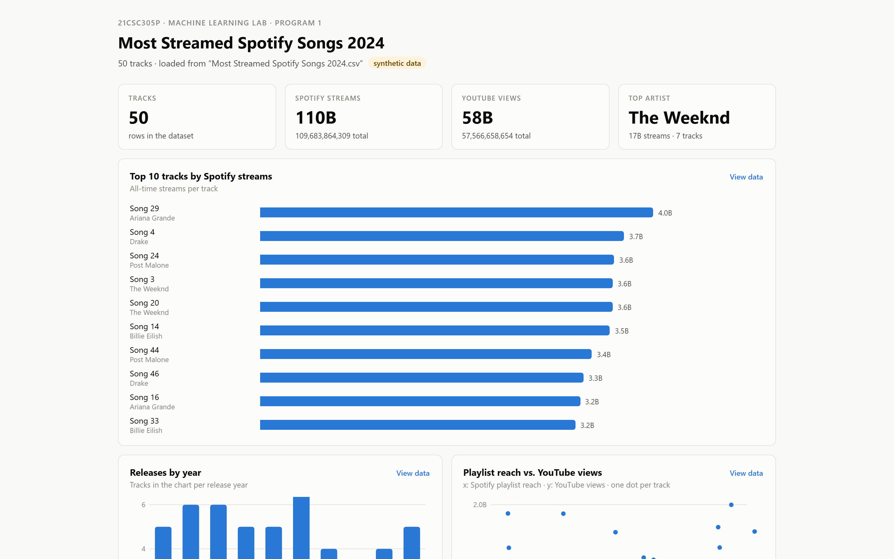

# ML-Projects

> Lab work for 21CSC305P — Machine Learning, SRM Institute of Science and Technology.

Coursework, not portfolio projects. Kept public so the exercises are reviewable. Each program is self-contained and runnable on its own.

## Programs

| # | Folder | Exercise | Techniques |
|---|---|---|---|
| 1 | [`program1/`](program1/) | Dataset loading and inspection — copy, column-subset selection, and an interactive view of the result | pandas, dataframe manipulation, interactive visualisation |

## Screenshot



`program1/dashboard.py` renders a self-contained HTML dashboard from the same
dataframe `program1.py` builds — summary statistics, the selected column subset and
the top rows. The source CSV (Most Streamed Spotify Songs 2024) is not committed, so
`program1.py` generates a synthetic stand-in with the same shape when it is absent;
that is what is shown here, and the dashboard says so.

Regenerate it with:

```bash
cd program1
pip install -r requirements.txt
python dashboard.py        # writes output/dashboard.html
```

## Getting started

### Prerequisites

- Python 3.10 or later

### Running

Each program folder is independent.

```bash
cd program1
pip install -r requirements.txt
```

Then open the notebook in that folder, or run its entry-point script.

## Structure

```
ML-Projects/
└── program1/          # dataset loading, subsetting, interactive dashboard
```

Each folder contains its own `requirements.txt` and is intended to be read on its own. There is no shared package.

## Note

This repository tracks lab submissions for a course in progress and grows over the semester. It is not intended as a demonstration of independent work — see the pinned repositories on my profile for that.
